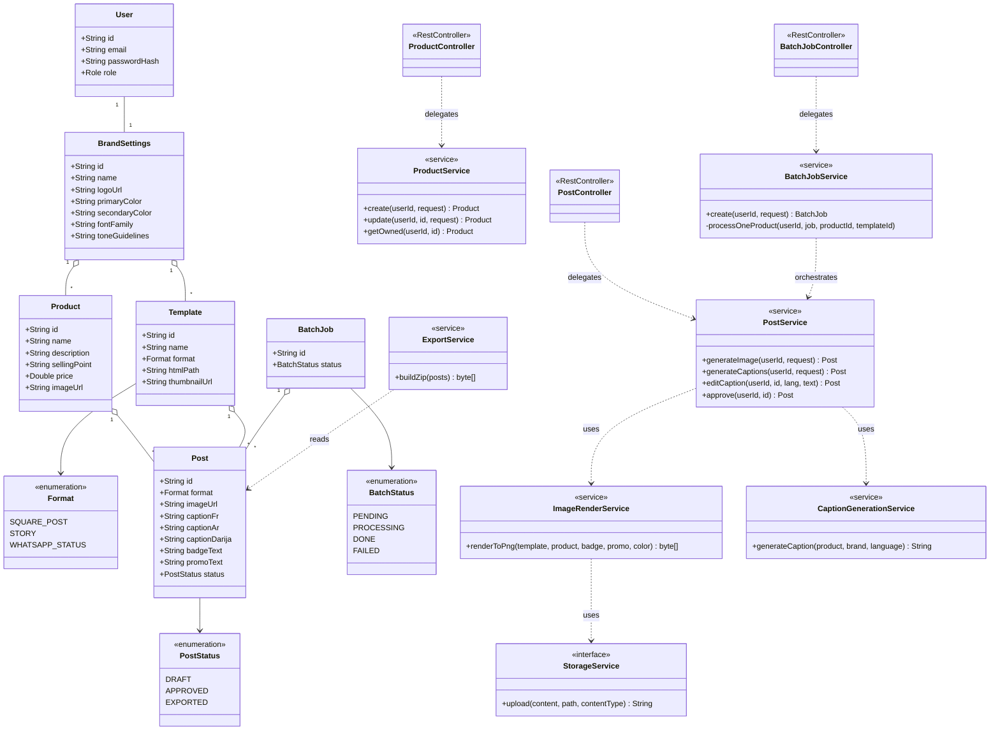

# Maamora Content Automation — Logique, architecture et répartition des tâches

Document de travail pour Ayoub & Mouad. Mis à jour le 14/07/2026 suite à la décision de passer sur une architecture découplée : **backend Spring Boot + PostgreSQL**, **frontend Next.js/React** (repris de l'existant). Un scaffold prêt à coder (`backend/`, `frontend/`, `docker-compose.yml`) accompagne ce document — voir `SCAFFOLD_README.md` à la racine du zip fourni.

## 0. État des lieux et décision d'architecture

Le repo `maamora/SM-content` (branche `main`, dossier `studio/`) contenait déjà, avant ce document : Next.js 16 + React 19 + Tailwind, NextAuth v5 (configuré mais sans provider actif), Prisma + SQLite avec les modèles `User`/`BrandSettings`/`Product`, un CRUD produit fonctionnel (`ProductForm`, `ProductList`, `product.actions.ts` avec vérification de propriété du brand), et un `CreativeStudio.tsx` entièrement simulé (légendes codées en dur, `setTimeout` au lieu d'un appel IA, canvas en CSS, téléchargement en `alert()`).

Décision prise : plutôt que de continuer en full-stack Next.js (Server Actions + Prisma), le backend devient une **API REST Spring Boot séparée**, avec **PostgreSQL** comme base. Le frontend Next.js devient un pur client de cette API (fetch/JSON), plus de logique métier ni d'accès base de données côté Next.js. Raison : stack demandée par l'équipe, et ça clarifie la frontière backend/frontend demandée pour la répartition des tâches — dans une architecture découplée, "backend" et "frontend" ont un sens sans ambiguïté (contrairement à Next.js où Server Actions brouillent la ligne).

Le dossier `studio/` existant n'a pas été touché. Le scaffold ajoute `backend/` (nouveau, Spring Boot) et `frontend/` (copie de `studio/`, augmentée d'un client API typé vers le backend — voir `frontend/MIGRATION_NOTES.md` pour la liste de ce qui devient obsolète : Prisma, NextAuth, les server actions).

## 1. Logique du produit (pipeline bout en bout)

**1. Authentification & marque.** Spring Security + JWT (stateless, pas de sessions). `POST /api/auth/register` crée un `User` + son `BrandSettings` associé ; `POST /api/auth/login` renvoie un JWT que le frontend stocke et renvoie dans le header `Authorization: Bearer`. `BrandSettings` porte l'identité de marque : logo, couleurs, police, ton de voix.

**2. Saisie produit.** Le frontend appelle `POST /api/products` (voir `frontend/src/lib/api/products.ts`, déjà scaffoldé). Le backend (`ProductController` → `ProductService`) valide (Bean Validation sur `ProductRequest`) et persiste via `ProductRepository`.

**3. Choix template + format.** `GET /api/templates` renvoie les templates disponibles pour la marque (globaux + propres à la marque). Chaque `Template` référence un fichier HTML/CSS (`htmlPath`) et un `Format` (carré / story / statut WhatsApp).

**4. Génération de l'image.** `POST /api/posts/generate-image` avec `{productId, templateId, badgeText, promoText, accentColor}`. Côté serveur (`PostService.generateImage` → `ImageRenderService`) : le fichier HTML/CSS du template est chargé, les `{{placeholders}}` sont remplacés par les données du produit, puis **Playwright** (Chromium headless) charge ce HTML et prend un screenshot PNG. Le PNG est envoyé à `StorageService` (implémentation par défaut : disque local, servie via `/files/**` — à remplacer par S3/Cloudinary plus tard sans toucher aux appelants, tout dépend de l'interface `StorageService`). Un `Post` est créé avec l'URL de l'image.

**5. Génération des légendes.** `POST /api/posts/generate-captions` avec `{postId, languages: ["fr","ar","darija"]}`. `CaptionGenerationService` appelle l'API Claude (une requête par langue), avec un prompt qui inclut le produit, le ton de la marque, et pour le Darija une instruction explicite de ne pas traduire littéralement.

**6. Aperçu & édition.** Le frontend affiche `Post` (image + 3 légendes). `PATCH /api/posts/{id}/caption` sauvegarde une édition manuelle d'une langue.

**7. Approbation.** `POST /api/posts/{id}/approve` → `status = APPROVED`. Rien n'est jamais publié automatiquement.

**8. Export (unitaire ou batch).** `GET /api/posts/{id}/export` renvoie un ZIP (image + 3 `.txt`). Pour plusieurs produits : `POST /api/batches` crée un `BatchJob` et lance le traitement de chaque produit **en parallèle limité** (voir section 4 — c'est la partie qui a changé suite à la question sur les limites de l'API Claude), puis `GET /api/batches/{id}/export` renvoie un ZIP unique avec un sous-dossier par produit.

Sécurité : chaque service (`ProductService`, `PostService`, `BatchJobService`) expose une méthode `getOwned(userId, resourceId)` qui vérifie que la ressource appartient bien au `brandId` de l'utilisateur authentifié avant toute lecture/écriture — repris du pattern IDOR déjà présent dans l'ancien `product.actions.ts`.

## 2. Diagramme de classe



Ce diagramme correspond exactement au code scaffoldé dans `backend/src/main/java/com/maamora/studio/` : `model/` pour les entités JPA et enums, `service/` pour les classes `<<service>>`, `controller/` pour les `<<RestController>>`. Pas de couche "View" au sens Spring MVC classique — c'est une API REST, donc les DTO de `dto/response/` jouent ce rôle (ce que le client reçoit réellement en JSON), pas des vues Thymeleaf/JSP.

## 3. Répartition des tâches — Backend / Frontend

Frontière nette maintenant que l'architecture est découplée : **backend = tout ce qui tourne dans le processus Spring Boot** (entités JPA, repositories, services, controllers REST, sécurité JWT, appel Claude, rendu Playwright, stockage). **Frontend = tout ce qui tourne dans Next.js/le navigateur** (composants React, formulaires, écran Studio, état, appels au client API dans `src/lib/api/`). Contrat entre les deux : les DTO `dto/request`/`dto/response` côté backend ↔ les interfaces TypeScript dans `frontend/src/lib/api/*.ts` (déjà écrites dans le scaffold, à garder synchronisées à la main pour l'instant — un contrôle de cohérence manuel suffit à cette échelle).

| Semaine | Backend | Frontend |
|---|---|---|
| **1** | Setup Spring Boot + PostgreSQL (déjà scaffoldé) ; brancher la vraie clé Claude API et tester `POST /api/auth/register` + `POST /api/posts/generate-image` avec le template `bold.html` fourni ; étendre `BrandSettings` si besoin d'autres champs de marque | Wireframes ; brancher `frontend/src/lib/api/auth.ts` sur un écran de login/register réel ; page de config de marque |
| **2** | Endpoints `Product` déjà scaffoldés — vérifier qu'ils tournent contre PostgreSQL ; ajouter un `TemplateSeeder` (`CommandLineRunner`) qui insère `bold.html` en base au démarrage | Brancher `ProductForm`/`ProductList` sur `frontend/src/lib/api/products.ts` au lieu des anciennes server actions |
| **3** | Vérifier `ImageRenderService` de bout en bout (installer le Chromium Playwright, tester le rendu réel) | Remplacer le "Live Brand Canvas" simulé de `CreativeStudio.tsx` par un vrai appel à `generateImage()` (déjà dans le client API) |
| **4** | Ajouter plusieurs templates HTML/CSS (formats carré/story/WhatsApp), endpoint `POST /api/templates` déjà prêt | Galerie de templates (miniatures), sélecteur de format, brancher badge/promo/couleur sur les vrais paramètres envoyés au backend |
| **5** | `CaptionGenerationService` déjà scaffoldé — tester en réel sur FR + AR, ajuster le prompt | Bouton "Générer les légendes" branché sur `generateCaptions()`, affichage FR/AR, gestion d'erreur/latence |
| **6** | Ajuster le prompt Darija (exemples few-shot validés par le social media manager) ; tester `PATCH /api/posts/{id}/caption` | Écran Preview & Edit complet (image + 3 légendes), édition inline, bouton "Approuver" branché sur `approvePost()` |
| **7** | `BatchJobService` déjà scaffoldé avec limitation de concurrence (3 en parallèle) — tester sur un vrai lot de produits, surveiller les erreurs 429 de l'API Claude | UI batch (sélection multi-produits, polling du statut `GET /api/batches/{id}`, barre de progression), export réel branché sur `exportBatch()` |
| **8** | Durcir la sécurité (revue des `getOwned()`), remplacer `ddl-auto: update` par Flyway si le temps le permet, tests unitaires sur les services critiques | Polish UI, test avec le social media manager sur produits réels, README utilisateur, support RTL pour arabe/darija |

## 4. Point d'attention : limites de l'API Claude en mode batch

Discuté en amont : un lot de N produits × 3 langues = 3N appels Claude. Sans limite, ça déclenche des 429 (rate limit) et, séparément, ça peut dépasser le temps d'exécution acceptable d'une requête HTTP si tout est fait de façon synchrone. `BatchJobService` (déjà scaffoldé) traite le lot en tâche de fond (`CompletableFuture` + `Executor`), avec une concurrence plafonnée à 3 produits en parallèle (`Semaphore`), et persiste chaque `Post` dès qu'il est prêt — un produit qui échoue n'interrompt pas les autres. Le frontend peut interroger `GET /api/batches/{id}` pour suivre la progression au lieu d'attendre une réponse unique bloquante.

Si les lots grossissent beaucoup plus tard (au-delà de quelques dizaines de produits), l'API "Message Batches" d'Anthropic (traitement asynchrone à -50% du coût, pool de rate limit séparé) devient pertinente — pas nécessaire à l'échelle de ce projet pour l'instant.

## 5. Structure du scaffold fourni

```
backend/                          Spring Boot (Java 17, Maven)
  src/main/java/com/maamora/studio/
    model/            entités JPA + enums
    repository/       Spring Data JPA
    service/          logique métier (rendu image, IA, stockage, export, batch)
    controller/        endpoints REST
    dto/               request/ + response/
    security/          JWT + Spring Security
    exception/         gestion d'erreurs centralisée
  src/main/resources/
    application.yml
    creative-templates/bold.html   template exemple (placeholder structurel, pas la vraie identité Maamora)
  README.md            instructions de lancement complètes
  .env.example

frontend/                         copie de studio/, augmentée
  src/lib/api/                    client REST typé vers le backend
  MIGRATION_NOTES.md              ce qui devient obsolète (Prisma, NextAuth, server actions)
  .env.local.example

docker-compose.yml                PostgreSQL local
SCAFFOLD_README.md                comment lancer le tout
```

Rien n'a été supprimé de `studio/` — `frontend/` en est une copie augmentée, à valider avant de supprimer l'ancien dossier.
